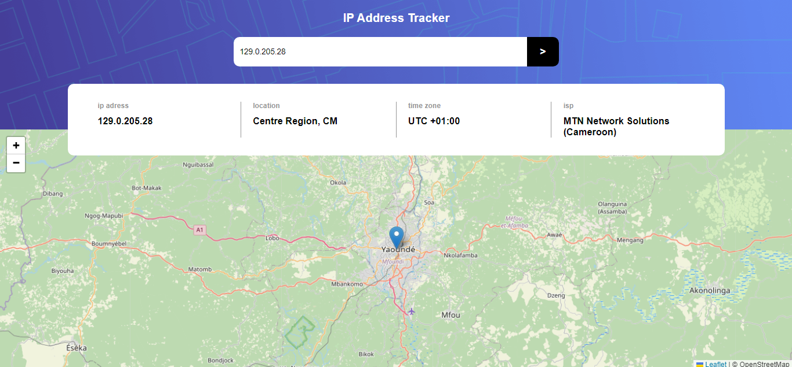

# Frontend Mentor - IP address tracker solution

This is a solution to the [IP address tracker challenge on Frontend Mentor](https://www.frontendmentor.io/challenges/ip-address-tracker-I8-0yYAH0). Frontend Mentor challenges help you improve your coding skills by building realistic projects. 

## Table of contents

- [Overview](#overview)
  - [The challenge](#the-challenge)
  - [Screenshot](#screenshot)
  - [Links](#links)
- [My process](#my-process)
  - [Built with](#built-with)
  - [What I learned](#what-i-learned)
- [Author](#author)

**Note: Delete this note and update the table of contents based on what sections you keep.**

## Overview

### The challenge

Users should be able to:

- View the optimal layout for each page depending on their device's screen size
- See hover states for all interactive elements on the page
- See their own IP address on the map on the initial page load
- Search for any IP addresses or domains and see the key information and location

### Screenshot



### Links

- Solution URL: [solutione](https://www.frontendmentor.io/solutions/ipaddress-tracker-with-webpack-m5-qUyI0FI)
- Live Site URL: [live site](https://ip-tracker-marc-12.netlify.app/)

## My process

### Built with

- Semantic HTML5 markup
- Flexbox
- Mobile-first workflow
- [sass](https://sass-lang.com/) - CSS framework
- [webpack](https://webpack.js.org/) - JS library
- [IP tracker API](https://geo.ipify.org/docs) - Geo API
- [leafletjs](https://leafletjs.com/examples/quick-start/) - MAP API

**Note: These are just examples. Delete this note and replace the list above with your own choices**

### What I learned

To day's challenge was a great was to learn how to work with multiple APIs in a same project, use fect(), async/await.

```html
<h1>Some HTML code I'm proud of</h1>
```
```scss
@mixin devices ($breakpoint) {
  @if $breakpoint == 769 {
    @media only screen and (min-width: 769px) {
      @content;
    }
  }
}
```
```js
const display_ip = (ip_address)=> {
  // a condition to check weither or not the IP is entered
  let api_ip;
  if (ip_address === undefined) {
    api_ip = API;
  } else {
    api_ip = API + ip_address;
  }

  // now we fetch the datas
  fetch(api_ip).then(response => response.json()).then(datas => {
    // we display our data
    ip.innerHTML = `${datas.ip}`;
    location.innerHTML = `${datas.location.region}, ${datas.location.country}`;
    timezone.innerHTML = `UTC ${datas.location.timezone}`;
    isp.innerHTML = datas.isp;

    //we call our display_map funct
    display_map([datas.location.lat, datas.location.lng])
  }).catch(error => alert('Sorry for the inconvenient, retype your IP Address please!'))
}
```

## Author
- Frontend Mentor - [@Marcraphael12](https://www.frontendmentor.io/profile/Marcraphael12)
- GitHub - [@Marcraphael12](https://github.com/Marcraphael12)
